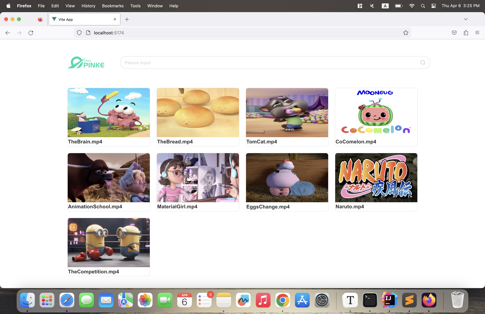

# VOD Front End

技术栈:Vue3, axios, ElementPlus

### 功能

展示VOD(Video On Demand)系统实现的功能

- 视频资源来自于多台服务器
- 模糊搜索功能
- 展示所有服务器的所有视频
- 播放视频



### 安装(需配合VOD Web Application一起使用)

```shell
git clone https://github.com/FENGRUI99/VOD-FrontEnd
cd VOD-FrontEnd
npm install
npm run dev
```

